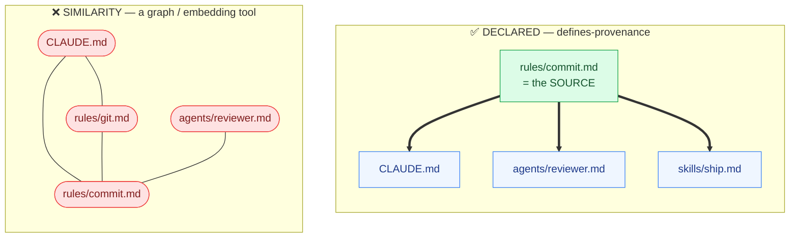
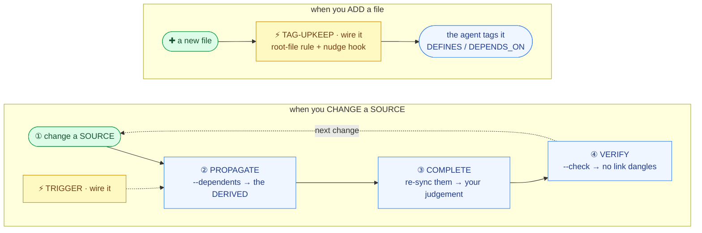

<!-- DEPENDS_ON: CONVENTION.md -->
<!-- DEPENDS_ON: ONBOARDING.md -->

# defines-provenance

**defines-provenance** is dependency tracking for markdown files in your library — *declared, not inferred*.

Your agent's rules start quietly contradicting each other. You fix one file; the others that referenced
it silently rot — and nothing tells you. Past ~100 files you can't even tell which file is a rule's
*authoritative source* and which just *mentions* it. It's not only agent rules — wherever one file is the
*source of truth* others must track (a product spec, a company handbook, API docs), the same drift creeps
in the moment you change it.

The usual tools don't help. You reach for a knowledge-graph, an embedding tool, your `[[wikilink]]`
backlinks — and they hand you **similarity**: every file that says "auth" wired to every other.
Beautiful, and useless for the one question you actually have: *when I change this, what depends on it?*

> **Similarity is not dependency** — and dependency can't be inferred, only **declared**.



That's the whole idea behind **defines-provenance**: you *declare* which file is the *source* of a
concept and which merely *depend on* it, and a checker verifies every link mechanically — so they never
silently rot.

## Try it in 10 seconds

No install — watch it catch a dangling link in the bundled example:

```console
$ DEFINES_ROOT=examples/broken python3 defines_provenance.py --check
🔴 1 broken DEFINES/DEPENDS target(s) (path contains a directory)
  bad.md [DEPENDS_ON] rules/ghost.md
$ echo $?      # 1 → a release script / CI refuses to merge
1
```

That same `--check` runs on your own library — silent, exit 0 when every declared link resolves, **1** on the first that dangles.

## Start with your AI agent

defines-provenance is **one vendored file** — `defines_provenance.py`, Python 3 standard library, nothing
to `pip install`. The fastest way in is to let your agent set it up — point it at this repo and say:

> *Add defines-provenance to this library: vendor `defines_provenance.py` from its repo into my files,
> then tag them following its ONBOARDING.md — propose the SOURCE / DEPENDS_ON markers and let me confirm
> each one.*

Your agent grabs the one file and *drafts* the provenance markers; you *confirm* them — at any size, even
a handful of files, **the agent tags and you review, never by hand**.

**Rather drive it yourself?** Drop `defines_provenance.py` into your repo and paste the
**[Setup prompt](ONBOARDING.md#setup-prompt)** — same flow, your hands on the wheel.

Full walkthrough — tag the library, then wire the two upkeep moments (re-check on a SOURCE change, tag new
files as they land) → **[ONBOARDING.md](ONBOARDING.md)**.

## What's in here

A concept has exactly **one home**. The file that owns it declares `<!-- DEFINES: X -->` — it is the
**SOURCE** of X; every file built on it declares `<!-- DEPENDS_ON: <source> -->` — it is **DERIVED**.
One rule makes it pay: **SOURCE overrides DERIVED** — change the source and the derived files get pulled
back in sync, never the reverse. (One screen: **[CONVENTION.md](CONVENTION.md)**.)

It rots **two** ways — you **change** a SOURCE and its dependents fall behind, or you **add** a file and it
never gets declared — so it has **two upkeep moments**, both wired into your runtime **by your agent (you
just review)**:



Four pieces keep that convention fresh, all load-bearing — `detect` and `propagate` are the checker;
`trigger` and `tag-upkeep` your agent wires in through onboarding. Full how-to-wire →
**[ONBOARDING.md](ONBOARDING.md#wire-the-trigger--close-the-loop-automatically)**.

| piece | what it does | how |
|---|---|---|
| **detect** | every declared link resolves — exits **1** on a dangling ref (CI gate) | `--check` |
| **propagate** | change a SOURCE → lists exactly the DERIVED to re-check (`--concept X` narrows) | `--dependents` |
| **trigger** | runs detect + propagate automatically on each edit | agent wires a hook |
| **tag-upkeep** | a new file gets declared before it escapes the convention | agent wires a rule + nudge |

None of it auto-syncs your *content* — it proves the *links* never dangle and names what to re-check;
completing the sync stays your judgement.

## See it in action

### Evidence — one real corpus, conditions stated

- **~1170** declared markers across one person's library; **~99.9%** resolve (1 known out-of-scope break).
- **28 / 28** hermetic self-test units pass — non-ASCII paths, ideographic commas, fenced-vs-live markers, baseline round-trip, concept-scope parse / filter / fail-safe / advisory, ReDoS guard.
- Single-file Python 3 stdlib, no install; `--check` exits **1** on any 🔴 so a release script / CI can *refuse* to merge.

> **Honest caveat:** coverage is *measured* — **catch-rate** against real contradictions and **false-positive rate** are *not*.

### Three moments, on this very repo

*The checker obeys the rule it enforces.*

**① The daily loop** — change a SOURCE, and `--dependents` hands you the exact files to re-check, not the whole library:

```console
$ DEFINES_ROOT=examples/clean python3 defines_provenance.py --dependents index.md
# 1 file(s) DEPENDS_ON index.md:
── concept: project-conventions ──
auth.md
```

→ re-sync `auth.md` by your judgement, not re-scan 100 files. Changed only *one* concept? `--dependents index.md --concept project-conventions` narrows to just its dependents, and a keyword grep catches any that were mis- or under-tagged.

**② The gate** — that same `--check` (shown at the top) is the CI gate: a dangling reference exits **1**, so a release script / CI refuses to merge a silent break.

**③ The create-moment** — a new untagged file lands in an area you've already tagged, and the companion nudge reminds you to declare it before it silently escapes the convention:

```console
$ echo '{"tool_name":"Write","tool_input":{"file_path":"examples/clean/new-rule.md"}}' \
    | python3 examples/hooks/defines_tag_nudge_hook.py
[defines-tag] New file examples/clean/new-rule.md sits in a provenance-tagged area but declares no
  <!-- DEFINES: --> / <!-- DEPENDS_ON: -->. If it owns a concept or derives from one,
  tag it (see CONVENTION.md). If it is neither, ignore this.
```

## Why not just…

| Instead of … | gives you | why it isn't this |
|---|---|---|
| cclint / AgentLint / ai-rules-sync | lint + sync agent-rule files | don't model **provenance** — the declared SOURCE of a concept — as a first-class, grep-able fact |
| codegraph / espalier | code-dependency graphs | code-only — lean on a compiler / import graph a prose library lacks |
| a knowledge-graph / embedding tool | a similarity graph (by content) | similarity, not declared dependency — the whole point is the two differ |
| Obsidian / `[[wikilink]]` backlinks | an association web (by hand-link) | a backlink says two files *relate* — never which is the SOURCE and which must track it |
| just `grep` / a sync script | whatever you cope with today | enough while small; earns its keep once "which file is authoritative for X" stops fitting in your head |

## Honest limits

- **N=1.** Built and run on one person's library (the numbers above). *"Proven effective"* is a claim this
  tool hasn't earned yet — adopt the idea, measure it on your own data.
- **It checks link existence, not whether your SOURCE/DERIVED labelling is *correct*.** It won't tell you a
  concept's home is the wrong file — only that the links you wrote still resolve. Same for a `#concept` that
  points at a valid-but-wrong concept: `--check` stays silent, and the **propagation content-grep** is what
  catches it (the agent greps the concept's keywords and re-tags on the next change).
- **Concept-scoping is opt-in; whole-file is the default.** It assumes single-slug concept names
  (`session-rules`), so a library that names concepts in prose gives them a slug first (the description can
  ride in a trailing `(…)`). The mechanism is self-tested **and dogfooded on the author's own multi-concept
  sources** (`vault-iterate`, `plan-gates`) — focused dependents (ADR/decision docs, 1 doc = 1 concept) scope
  cleanly; broad consumers stay whole-file via the fail-safe. Reach for it on genuinely multi-concept SOURCEs;
  whole-file `DEPENDS_ON` is the always-safe default.
## License

MIT — see [LICENSE](LICENSE).
